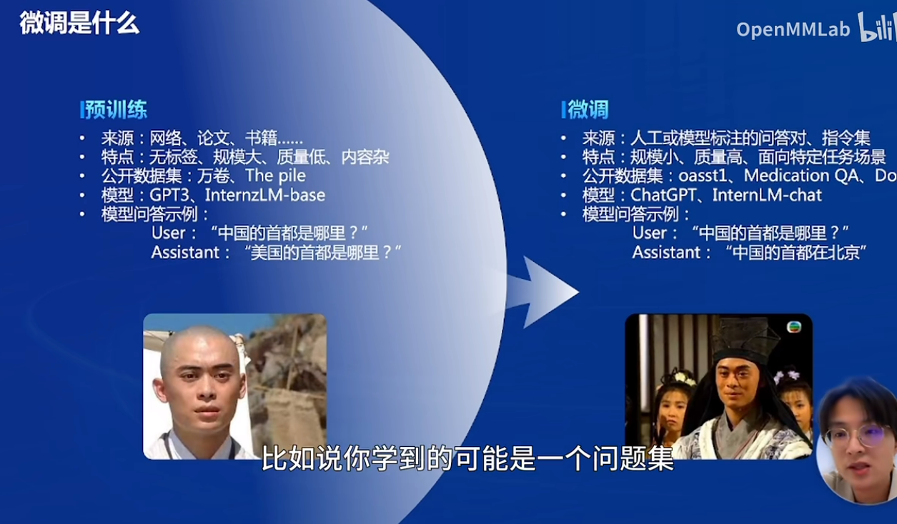
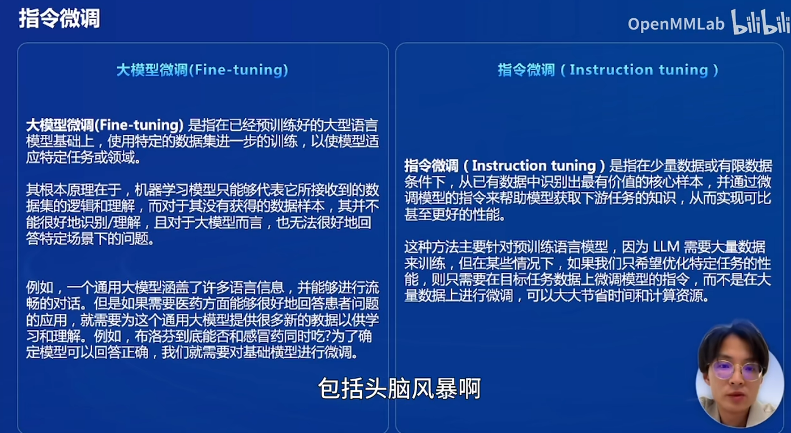
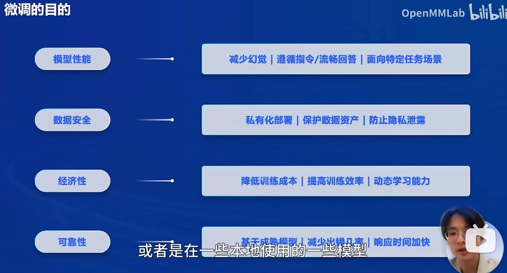
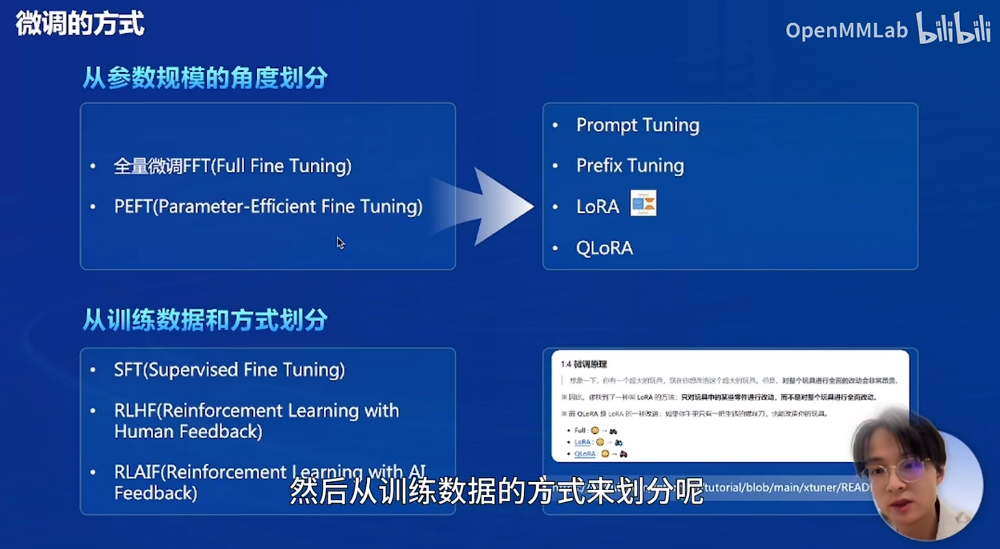
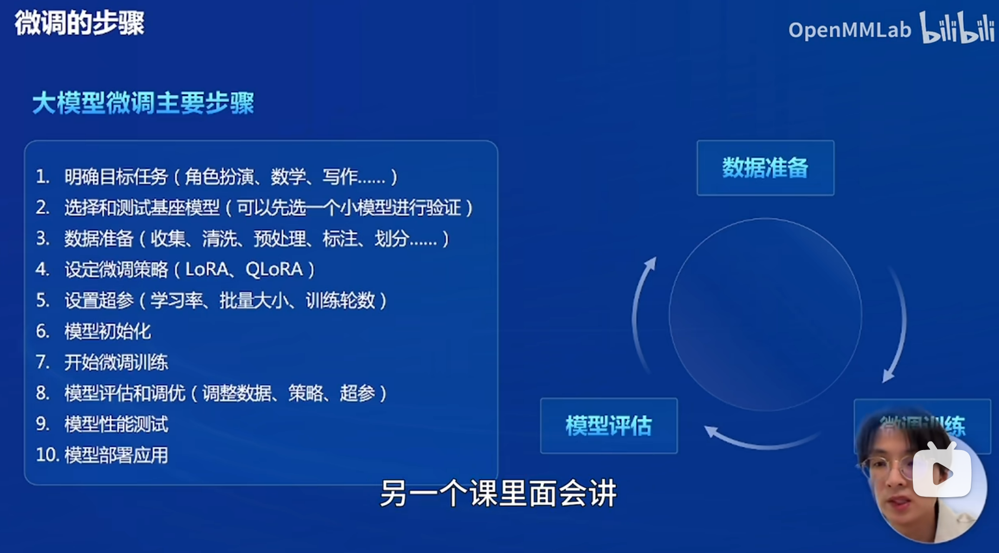
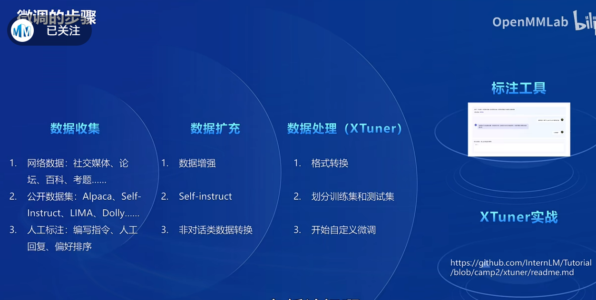
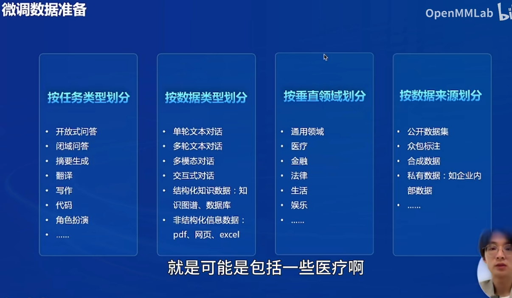
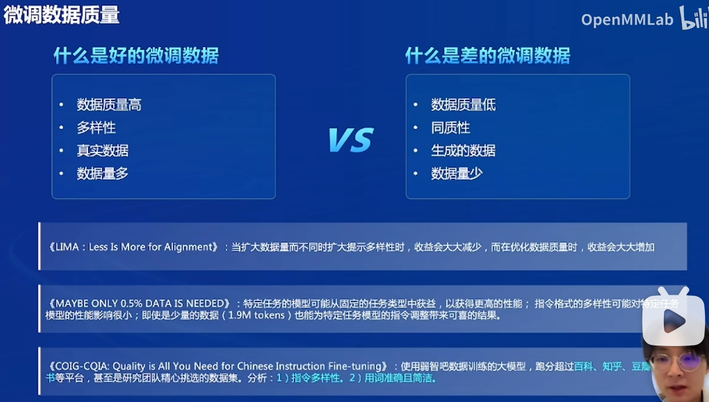
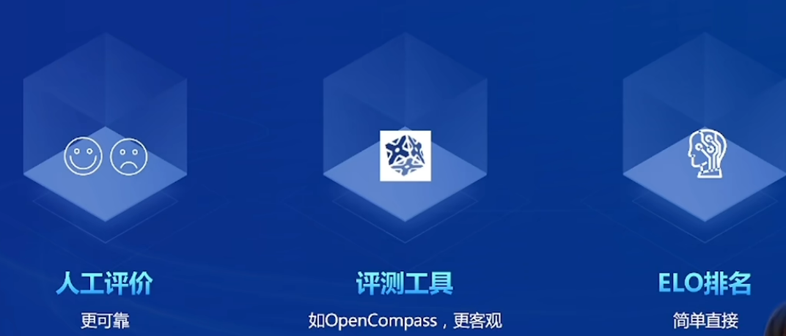

# InternLM2-Tutorial-Assignment-Lecture8    
# 第八课 大模型微调数据构造
[第8课视频](https://www.bilibili.com/video/BV1Dx4y1z7Ju/?share_source=copy_web&vd_source=47e542edac1449ad64dfdd48f87dc45b)    

2024.4.26  OpenDataLab团队 商富凯

# 第8课 笔记    

# 理论    

## 微调是什么    

大模型预训练比喻虚竹学了很强的内功，微调比喻虚竹掌握了个门派的武功变成武林高手。    

- 大模型微调（fine-tuning）
- 指令微调（instruction tuning）
  

## 微调的目的    
- 减少幻觉
- 提升流畅性
- 数据安全
- 降低训练成本
  
  

## 微调的方式

  - 从参数规模的角度划分：
    - 全量微调 (Full Fine Tuning)    
    - PEFT(Parameter-Efficient Fine Tuning)
  - 从训练数据和方式划分:
    - SFT(Supervised Fine Tuning)
    - RLHF(Reinforcement Learning with Human Feedback)
    - RLAIF (Reinforcement learning with AI feedback)
      
  

## 微调的步骤    

- 数据准备 - 微调训练 -  模型评估
- 数据收集 - 数据扩充 -  数据处理
  
   
    

## 微调数据准备    

按垂直领域划分： 医疗 金融  法律......    

     

微调数据质量: 好的和差的微调数据    

      

## 微调结果评价    

- 人工评价
- 评测工具 OpenCOmpass
- ELO排名

    

  
